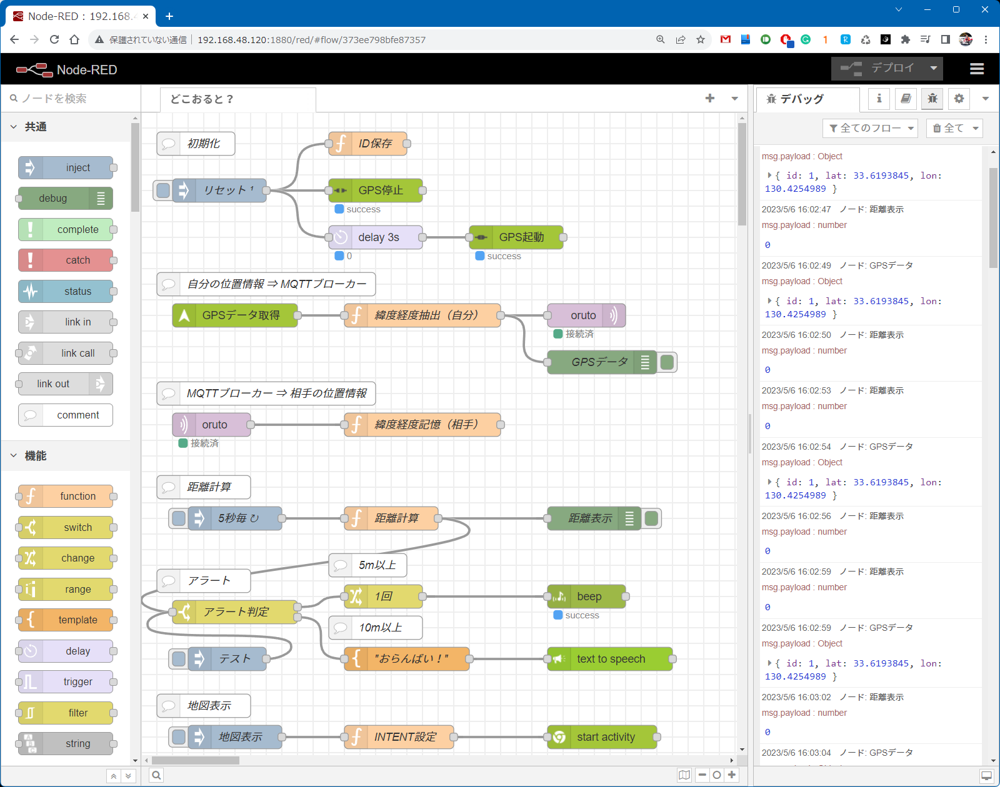
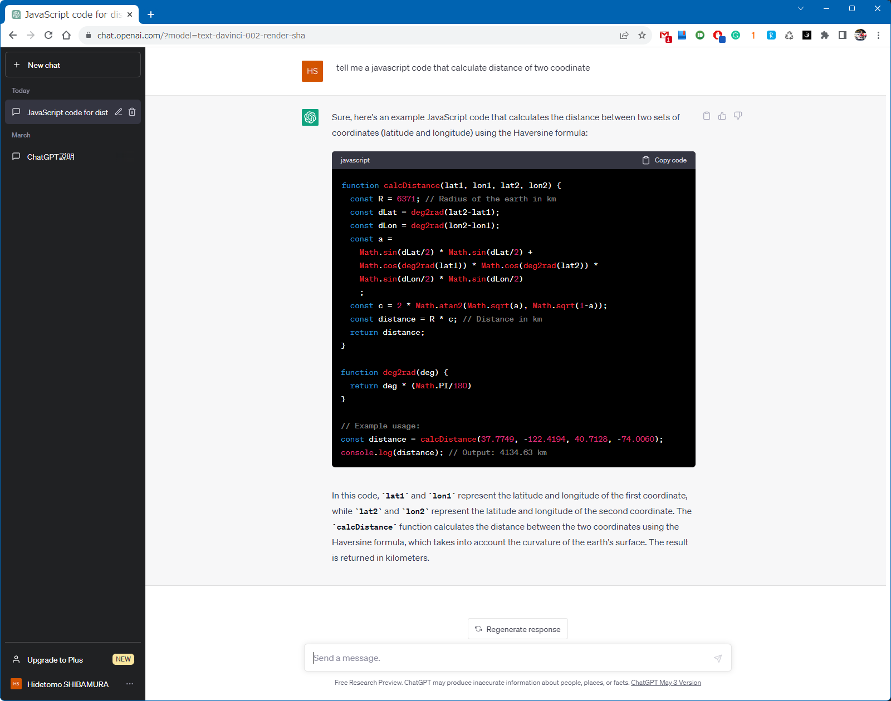
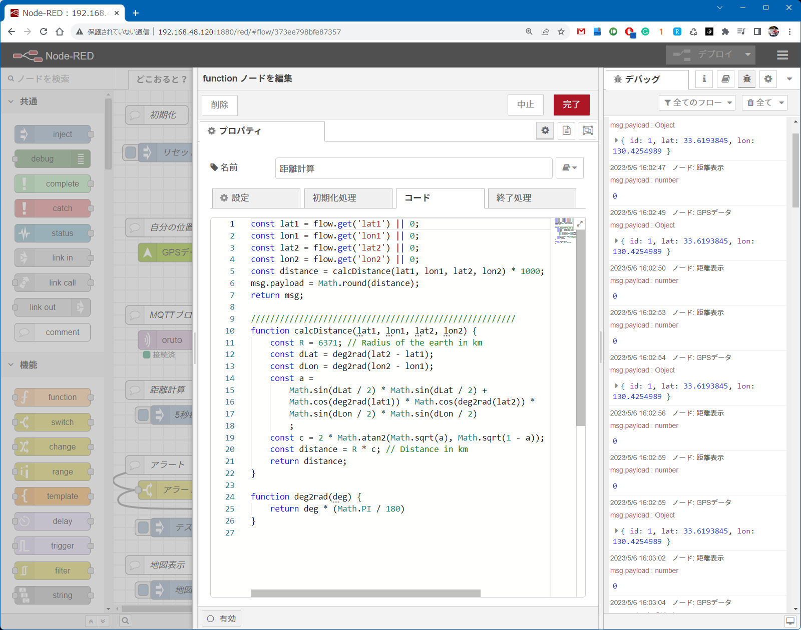

# 「博多どんたく迷子をなくせ！」

**迷子防止アプリをNode-REDでお手軽に開発**

- connpass 「Node-RED Flow 大喜利 in 博多（2023/5/8開催）」向け資料

## はじめに

４年ぶりに通常開催された博多どんたく（正式名称「福岡市民の祭り 博多どんたく港まつり」）は、
初日に１００万人の人出だったそうです。
ちびっ子を連れた親御さんやカップルは迷子にならないかすごく心配でしょうね。

写真出典： https://fukuoka-ropponmatsu.com/

迷子にならないよう現在地を表示するアプリはよく見かけますが、
今回は迷子になる前に注意喚起する方針としました。

## 基本メカニズム

動作はいたってシンプル。
機器Aと機器Bの位置情報から2点間距離を計算し、一定以上離れたらアラートを出します。
具体的には、

1. 機器に搭載されたGPSから「自分の位置情報（緯度経度）」を読出し、
定期的にMQTTサーバに転送（MQTT publish）
2. 一方、「相手の位置情報」をMQTTから読出し（MQTT subscribe）、
お互いの位置情報から離れている距離を計算
3. そして、距離が一定以上であればアラートを発生

今回は以下のココロで開発しました。

- 屋外で使えること
- ガッツリ作り込まないこと
- お気楽に作れること

大喜利ではあるけれど、座布団３枚は狙わずに逆にツッコミどころ満載の方が楽しいかと。

## ハードウェア

最初は RPi Pico W ＋ 自作GPSモジュールをベースに Node-RED MCU Edition
で作り込もうとしていましたが、どんたく広場のど真ん中にブレッドボードと
モバイルバッテリーを抱えた男が歩いていたら、、、「絶対に職質される！」でしょうね。

おまけに、博多どんたくは例年「雨に降られる」というローカルなジンクスがあるため、
結局、可搬性の良いスマホとタブレットに決定。（え？！スマホでNode-RED？）

## ソフトウェア

Node-RED MCU に後ろ髪を引かれつつ、今回はスマホで動作する Node-RED である
[RedMobile](https://play.google.com/store/apps/details?id=com.okhiroyuki.redmobile)
に決定。

https://play.google.com/store/apps/details?id=com.okhiroyuki.redmobile

FYIとして、Ver.8.0.0 が2023/3/21にリリース。
ちょっとの時間でもPCを開けずにフローを熟考できるのは非常に楽しいです。
また、スマホを操作するノードが充実しているのでIoTエンジニアとしては非常に重宝しています。

## Node-REDフロー

作成したフローは以下のとおり。各ノードの詳細はフロー(doko-oruto.json)
をダウンロードしてご覧下さい。
ちなみにタブ名称「どこおると？」は博多弁で「どこにいるの？」です。

### 概説

- **初期化**

  フロー起動／リセット（injectionボタン押下）に呼応して、
  1. 自分のIDを設定し（flow変数） ※ここにスマホの電話番号を入れたかった
  2. GPSを一旦停止して ※再起動に備えて
  3. 3秒待って、GPSを起動 ※ちょっと待たないと起動しなかった

- **自分の位置情報⇒MQTTブローカー**

  1. GPSデータを読取り（RedMobileのlocaltionノード利用）
  2. GPSデータから緯度経度を抽出し、IDを付加して位置情報を保存（flow変数）
  3. その位置情報をMQTTブローカーに送信（MQTT publish）
  ※test.mosquitto.orgに平文で送っています

- **MQTTブローカー⇒相手の位置情報**

  1. MQTTブローカーからpublishされた相手の位置情報を受信（MQTT subscribe）
  2. 相手の位置情報を変数保存（flow変数）※Node-RED大喜利としてはいかがなものか？

- **距離計算**

  1. 5秒毎に以下を処理
  2. 「距離計算（functionノード）」内で2地点間の距離を計算し、
  3. その距離を表示

- **アラート**

  1. 計算された距離を判定し、
  2. ５m以上離れていたら、1回だけスマホのビープを鳴らす（beepノード）
  3. 10m以上離れていたら、メッセージを発話する（text to speechノード）
  ※ちなみに、「おらんばい！」とは博多弁で「（ここに）いないよ！」の意味。

- **地図表示**

  おまけですが、近くに見当たらない場合、
  1. injectionボタンをクリックすると、
  2. AndroidスマホのINTENT呼出を使って
  3. スマホに相手位置情報を中心とした地図を表示（start activityノードで呼出）

### ２地点の距離計算~~フロー~~

さて、本アプリのメインは２地点の緯度経度からの距離計算です。

有名な計算方式として、ハバーシンの公式（Haversine Formula）や
ヒュベニの公式（Hybeny's Distance Formula）があります。
以前に、後者を Python で書いたものがあるため、
~~手抜きをして~~お手軽にそれを実行させよう、、、
いや、RedMobile には exec があ～りません。。。
では、Javascriptに書き換えるか。。。~~ん～、拾ってくるか。。。~~
いや、ここは ~~手抜きをして~~最先端技術である **ChatGPT** を使って！

ChatGPT さんにつたない英語でお尋ねすると
３秒！で以下のありがたい呪符を授かりました。

そして、フロー中の「距離計算」ノードにそのままコピペで問題なく動いてしまいました。
※IT/IoTエンジニアとしてはいかがなものか？！(-_-;)

一応、テストデータを用いて、他のプログラムでの実行結果や
高精度計算サイトなどで精度検証しましたが、まったく問題なしです。
とはいえ、高精度は必要ありません。

## 動作確認

- ~~スマホ２台を用いて屋外にて動作確認を実施 **しようとスタンバイ中**
 （※現在2023/5/6、福岡は大雨。）~~

- MQTTサーバに、異なる2点間の位置情報を送信し、アラートが正しく発生するかテストした。
 （※現在2023/5/7、福岡はまだ大雨。）

https://user-images.githubusercontent.com/85855094/236654243-7b8723cc-b325-477c-b4ba-fc597d9d661c.mp4

## 今回のポイント

- スマホ版Node-RED「**RedMobile**」を利用した
- 距離計算プログラム生成？に 「**ChatGPT**」を利用した
- すごく短時間（実質３時間程度）でアプリができた
  ※flow変数の未定義時の挙動で時間とった

## つっこみどころ

- Androidスマホ専用です
- ３人以上に対応していません ⇒ 位置情報にIDを割り付けているので容易に拡張可能です
- Node-REDっぽくない ⇒ 筆者の力不足です

以上、ありがとうございました。

